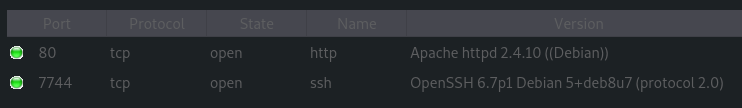

DC-1 | Vulnhub's CTF
====================

### https://www.vulnhub.com/entry/dc-2,311/

# Introduction

This CTF is one of the DC's CTF series. As the first one, the second is also made for beginners.

As always, we're going to collect informations about the target before attacking. Let's check this out.

## Discovering environment

Again, we just have a prompt to log in.
Before continuing, make sure to note VM's IP.
Mine is 192.168.1.32

I run Sparta to search open ports, and potentially secret web pages.

It's actually a web server, with a (weird) open ssh port.
When opening this website on a browser, it just looks like à classic (even default) Wordpress installation. VM's IP is redirecting us to http://dc-2/

First thing I noticed was the "Flag" page.

This text is about how we should crack passwords.
Using known wordlists wouldn't be efficient, we just "need to be cewl". I didn't know what was the meaning of "cewl" (btw I'm French), so I googled it and found that it was a command to extract words from a website, and make a wordlist with them.

Thinking about cracking passwords is great, but we don't have any information about this website's users.

To know this, I use WPScan. I didn't find vulnerable plugins or themes. Here are the registered users.

We just found three users: admin (classic), jerry, and tom.

## Cracking passwords

Remember the first flag. We need to create our own wordlist.

Done. We now need to find a way to test those passwords (because I won't try every pass for each user).

While searching in metasploit database, I found a exploit to enumerate logins and passwords. Let's try this!

Now we have to try with every user. I can't find anything for admin, but I found pass for tom and jerry.

Great! Let's log in as tom first, we'll try jerry later.
I couldn't find anything on this account.
Maybe jerry can help us...

and so he did! Here is a flag, amoung site's pages.

Hummm... currently, I have no idea what "shortcut" it's talking about. But apparently, there is another way.

I remembered ssh port I found at the beginning of the challenge. Maybe we can connect as tom or jerry.

I couldn't connect as jerry, but tom seems to have more permissions. Moving right along.

By doing some stuff on this shell, I quickly discoverd it wasn't a bash shell, but a r-bash shell (for "restricted bash").

We're not allowed to use every command installed, but only those which are in ./usr/bin folder.
Here is the list.

-- TO CONTINUE --
(it's bed time, sorry!)